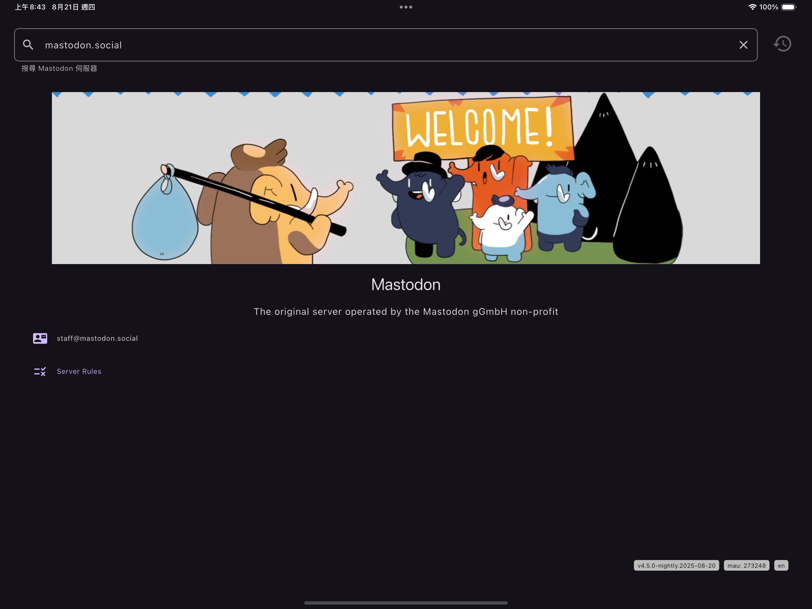
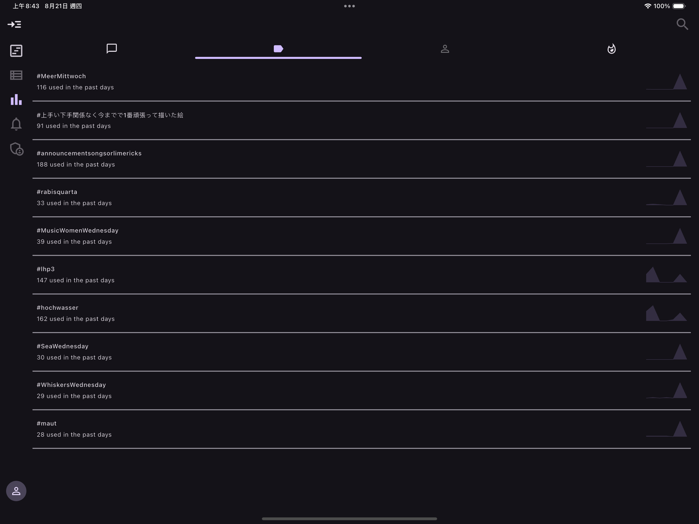
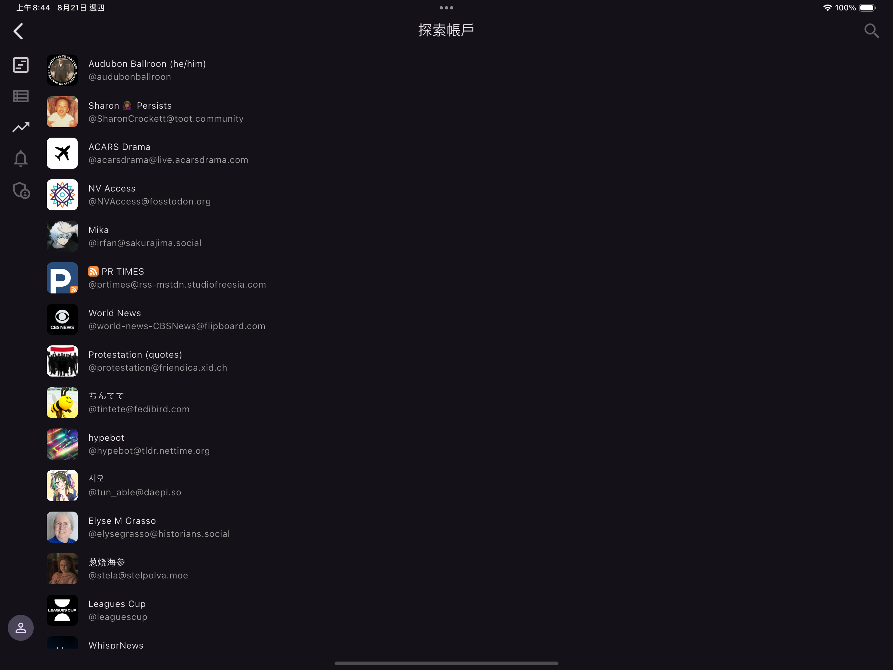

# Glacial

> The simple and easy to use Mastodon client

[![License: CC BY-NC-ND 4.0][0]][1]

[English](README.md) | [繁體中文](README_zh.md)

It is the simple and cross-platform Mastodon client that helps you to access and manage
your Mastodon account, on any device, anywhere, anytime.

## Features

Below are the features that have been supported and implemented. All features are implemented
based on the [OpenAPI][2] specification after processing the official documentation.

### Explore

At the beginning, it allows you to search for any Mastodon server (default to connect to mastodon.social),
and explore users, hashtags, and trending posts on that server.

## DDD (Dream-Driven Development)

This project is based on the DDD (dream-driven development) methodology which means the project
is based on what I dream of.

All the features are based on my needs and my dreams.

[0]: https://img.shields.io/badge/License-CC_BY--NC--ND_4.0-lightgrey.svg
[1]: https://creativecommons.org/licenses/by-nc-nd/4.0/
[2]: https://cmj0121.github.io/mastodon_openapi/
