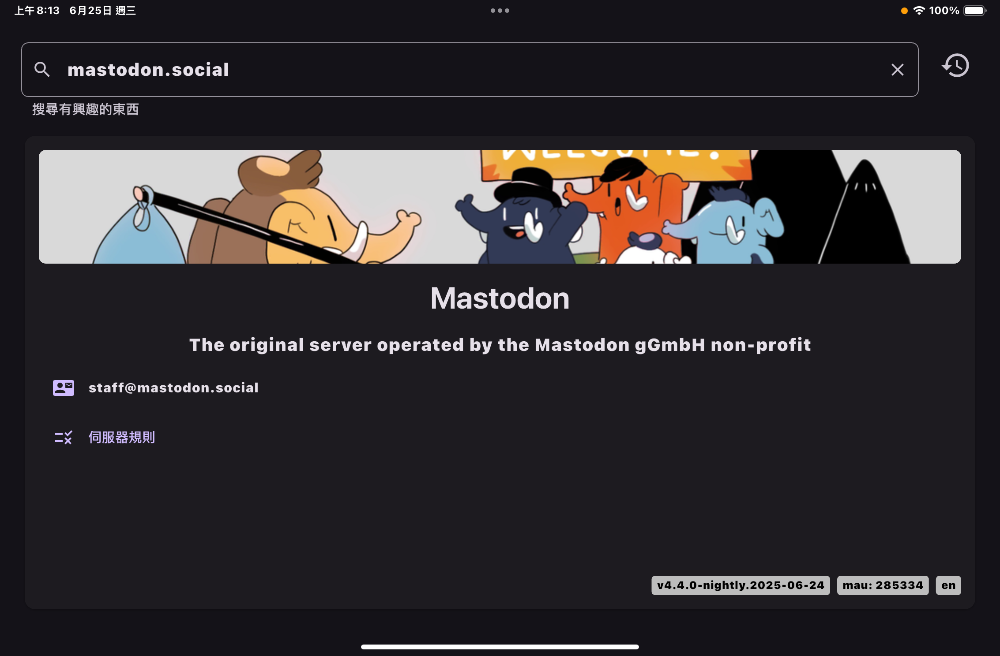
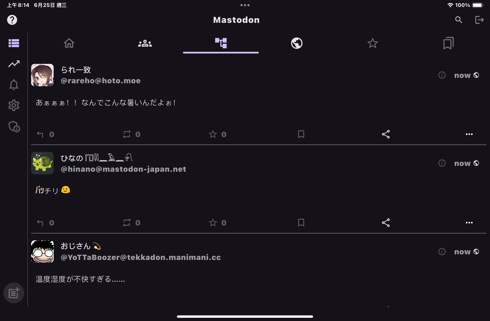
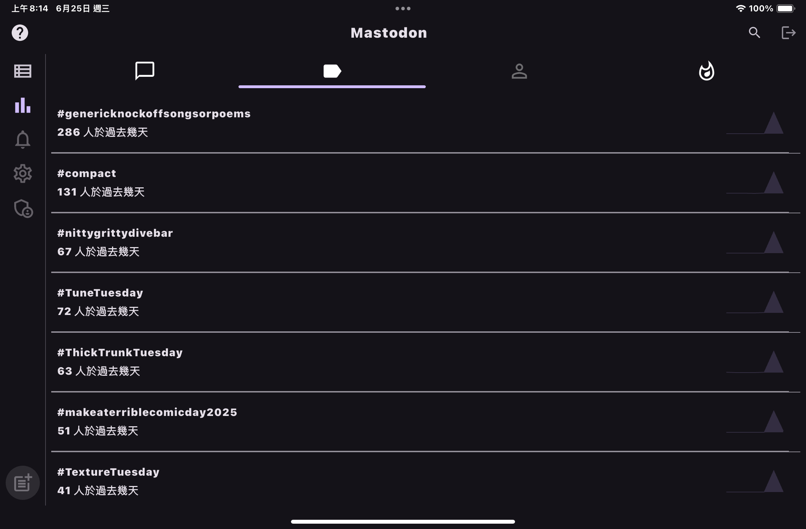

# Glacial

> The simple and easy to use Mastodon client

[![License: CC BY-NC-ND 4.0][0]][1]

**Glacial** is the simple and cross-platform Mastodon client that helps you to access and manage
your Mastodon account, on any device, anywhere, anytime.

## Features

This project is based on the current Mastodon [API version][2] and implements the minimal set of
features to access and manage your Mastodon account. The features are designed to be simple,
easy to use, and intuitive:

### Server Explorer


- Search the Mastodon servers by the server name or the server URL.
- Historical list of the Mastodon servers you have visited.

### Timelines


- A slider to switch between the timelines based on the current Mastodon server.
- Always show the latest posts in the timeline, and refresh the timeline by pulling down.

### Trends


- A list of the trending posts, hashtags, accounts, and links on the current Mastodon server.

### Explore / Search


- Search the accounts, posts or hashtags on the current Mastodon server.

### Other Unfinished Features

- [ ] Notifications
- [ ] Editor / Posting
- [ ] User Profile
- [ ] Administration
- [ ] Customized Settings

## Design Concept

The design concept of this project is to provide a simple and easy to use Mastodon client that
allows users to access and manage their Mastodon account with minimal effort. All the interfaces
are designed to be intuitive and user-friendly, by the intuitive iconography and layout.

User interfaces are designed to be less cluttered and text-heavy, focusing on the user generated
content rather than the application itself. User can find more descriptive information by the
tooltips, with the same localization as the [Mastodon project][3].

## Setup in Local

To set up this project in your local environment, you need to follow these steps:

1. clone the repository
2. setup your .env file for the credentials
3. build the project by [fastlane][4] on ios/ or macos/ directory

```.env
MATCH_GIT_URL=
APP_IDENTIFIER=
APPLE_ID=
TEAM_ID=
KEY_ID=
ISSUE_ID=
FASTLANE_APPLE_APPLICATION_SPECIFIC_PASSWORD=
```

## DDD (Dream-Driven Development)

This project is based on the DDD (dream-driven development) methodology which means the project
is based on what I dream of.

All the features are based on my needs and my dreams.

[0]: https://img.shields.io/badge/License-CC_BY--NC--ND_4.0-lightgrey.svg
[1]: https://creativecommons.org/licenses/by-nc-nd/4.0/
[2]: https://github.com/cmj0121/mastodon_openapi
[3]: https://github.com/mastodon/mastodon/tree/main/app/javascript/mastodon/locales
[4]: https://fastlane.tools/
