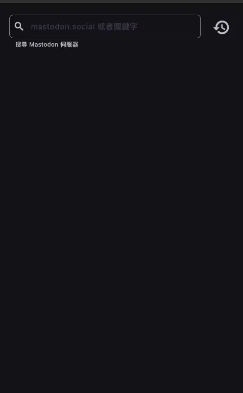
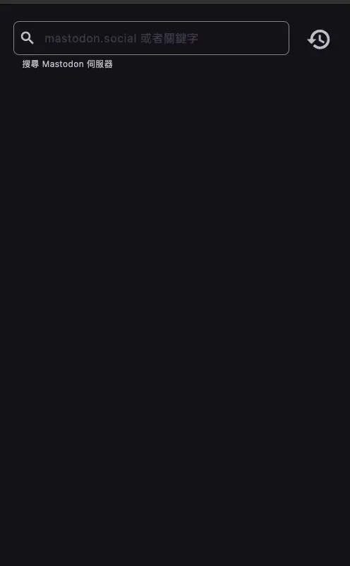
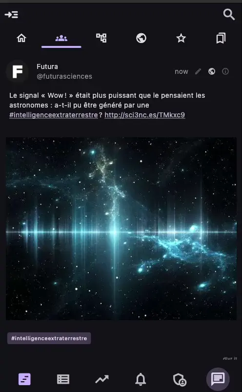

# 冰河

> The simple and easy to use Mastodon client

[![License: CC BY-NC-ND 4.0][0]][1]

[English](README.md) | [繁體中文](README_zh.md)

這是一個簡單易用的跨平台 Mastodon 客戶端，幫助您隨時隨地在任何設備上訪問和管理您的 Mastodon 帳戶。

## 功能

下面是已經支援且實作的功能。所有功能都根據官方提供的文件處理後的 [OpenAPI][2] 規範實作。

- 探索 Mastodon 伺服器、使用者、主題標籤和熱門貼文。
- 在任意 Mastodon 伺服器上登入和註冊帳號
- 在連接的 Mastodon 伺服器上搜尋使用者、貼文和主題標籤。
- 查看和編輯個人檔案資訊。

### 探索

一開始可以讓你搜尋任意的 Mastodon 伺服器 (預設先連到 mastodon.social)，並且可以探索該伺服器上的使用者、主題標籤、熱門貼文等。

### 登入

你可以使用你的帳戶登入任意的 Mastodon 伺服器，或是在該伺服器上註冊新帳號。登入後你擁有幾乎和官方 Mastodon 網頁客戶端相同的功能
，若你的帳號有相關權限還可以使用選用的管理員功能。

### 搜尋

你可以在連接的 Mastodon 伺服器上根據給定的關鍵字搜尋使用者、貼文和主題標籤。

### 個人檔案

你可以查看和編輯你的個人檔案資訊，包括你的頭像、標頭圖片、顯示名稱、簡介、位置和網站。你還可以查看你的追隨者、正在追蹤的人和清單。

## DDD (夢想驅動開發)

這個專案基於 DDD（夢想驅動開發）方法論，這意味著專案是基於我的夢想而建立的。

所有功能都是基於我的需求和夢想。

[0]: https://img.shields.io/badge/License-CC_BY--NC--ND_4.0-lightgrey.svg
[1]: https://creativecommons.org/licenses/by-nc-nd/4.0/
[2]: https://cmj0121.github.io/mastodon_openapi/
