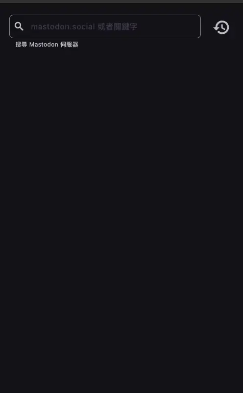
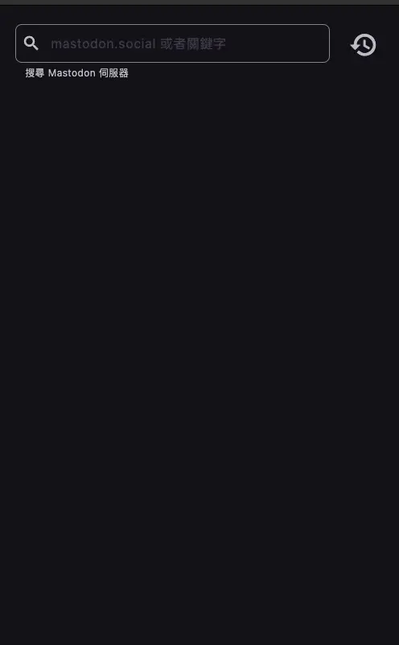
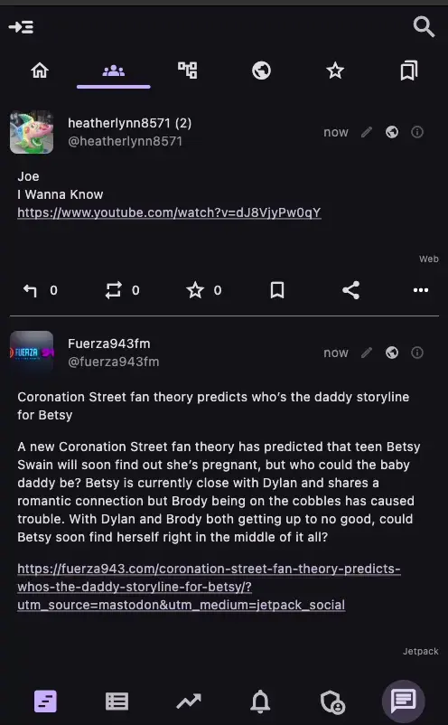
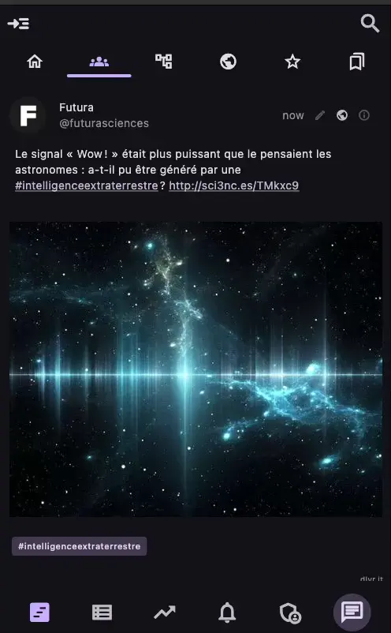

# 冰河

> The simple and easy to use Mastodon client

[![License: CC BY-NC-ND 4.0][0]][1]

[English](README.md) | [繁體中文](README_zh.md)

這是一個簡單易用的跨平台 Mastodon 客戶端，幫助您隨時隨地在任何設備上訪問和管理您的 Mastodon 帳戶。

## 功能

下面是已經支援且實作的功能。所有功能都根據官方提供的文件處理後的 [OpenAPI][2] 規範實作。

### 探索與發現

- 探索 Mastodon 伺服器、使用者、主題標籤和熱門貼文。
- 瀏覽公開帳戶目錄，支援排序選項（活躍度、最新、字母順序）。
- 查看熱門主題標籤、貼文和連結。
- 追蹤和取消追蹤主題標籤。

### 驗證與多帳戶

- 透過 OAuth2 在任意 Mastodon 伺服器上登入和註冊帳號。
- 在同一伺服器上切換多個帳戶。
- 持久化儲存帳戶以便快速切換。

### 時間軸

- 首頁、本站和跨站時間軸，支援即時串流更新。
- 最愛、書籤和釘選貼文時間軸。
- 清單時間軸和主題標籤時間軸。
- 可設定的重新整理間隔和項目數量限制。
- 可隱藏回覆或轉嘟。
- 離線快取，支援先顯示快取再更新策略，無網路也能閱讀。

### 搜尋

- 在連接的 Mastodon 伺服器上根據關鍵字搜尋使用者、貼文和主題標籤。

### 貼文與互動

- 撰寫、編輯、排程和刪除貼文。
- 可見性控制（公開、不列出、僅追隨者、私訊）。
- 媒體附件（圖片、影片、音訊、GIF）。
- 投票功能。
- 引用貼文，支援核准政策。
- 內容警告和敏感媒體標記。
- 最愛、轉嘟、書籤、釘選和靜音對話串。
- 對貼文使用表情符號反應（相容 Glitch/Pleroma/Akkoma）。
- 貼文翻譯。
- 查看編輯歷史。
- 透過系統分享功能分享貼文。

### 個人檔案

- 查看和編輯個人檔案（頭像、標頭圖片、顯示名稱、簡介、欄位）。
- 瀏覽追隨者、正在追蹤的人和清單。
- 在個人檔案上推薦（精選）帳戶。
- 對其他帳戶添加個人備註。
- 查看共同追隨者。

### 通知

- 群組通知（Mastodon API v2），包含提及、追蹤、最愛、轉嘟、投票和更新。
- iOS 背景輪詢與豐富本地通知。
- 按類型切換通知開關（提及、追蹤、最愛、轉嘟、投票、貼文）。
- 通知政策管理。
- 應用程式角標數字更新。

### 私訊

- 查看、管理和刪除對話。
- 標記對話為已讀。

### 清單

- 建立、編輯和刪除清單，支援回覆政策和專屬模式。
- 在清單中新增和移除帳戶。
- 專屬清單時間軸。

### 過濾與內容審核

- 建立、編輯和刪除內容過濾群組與關鍵字。
- 過濾動作：警告、隱藏或模糊媒體。
- 可針對首頁、通知、公開、對話串或帳戶設定過濾範圍。
- 管理靜音帳戶、封鎖帳戶和網域封鎖。
- 檢舉帳戶，支援分類原因。

### 管理功能

- 伺服器管理員儀表板。
- 管理使用者檢舉（指派、解決、重新開啟）。
- 管理帳戶（核准、拒絕、停權、靜音、取消敏感標記）。
- 基於角色的權限控制。

### 伺服器資訊

- 從應用程式側邊欄查看伺服器資訊（名稱、版本、描述、活躍使用者數、聯絡方式、語言、註冊狀態和規則）。

### 偏好設定

- **主題**：深色、淺色、自動和 OLED 純黑模式。
- **顯示**：可調整字體大小（0.8x - 1.4x）、圖片品質選擇。
- **時間軸**：自動播放影片、隱藏回覆/轉嘟、項目數量限制、重新整理間隔。
- **發文**：預設可見性、預設敏感內容、回覆標記行為、引用核准政策。
- **通知**：按類型切換開關。
- **語言**：支援 8 種語言（英語、德語、西班牙語、法語、日語、韓語、葡萄牙語、中文）。
- **無障礙**：觸覺回饋切換、螢幕閱讀器語義標籤。

### 技術亮點

- **即時串流**：透過 Mastodon Streaming API（WebSocket）即時更新，支援自動重連。
- **離線支援**：時間軸快取，先顯示快取再更新策略。
- **HTTP 彈性**：30 秒逾時、指數退避加抖動重試、速率限制處理。
- **記憶體內 LRU 快取**：帳戶和貼文快取。
- **背景擷取**：iOS 通知背景輪詢。
- **毛玻璃 UI**：搭配微光載入狀態和骨架畫面。
- **3200+ 自動化測試**：涵蓋模型、元件和整合測試。

## DDD (夢想驅動開發)

這個專案基於 DDD（夢想驅動開發）方法論，這意味著專案是基於我的夢想而建立的。

所有功能都是基於我的需求和夢想。

[0]: https://img.shields.io/badge/License-CC_BY--NC--ND_4.0-lightgrey.svg
[1]: https://creativecommons.org/licenses/by-nc-nd/4.0/
[2]: https://cmj0121.github.io/mastodon_openapi/
